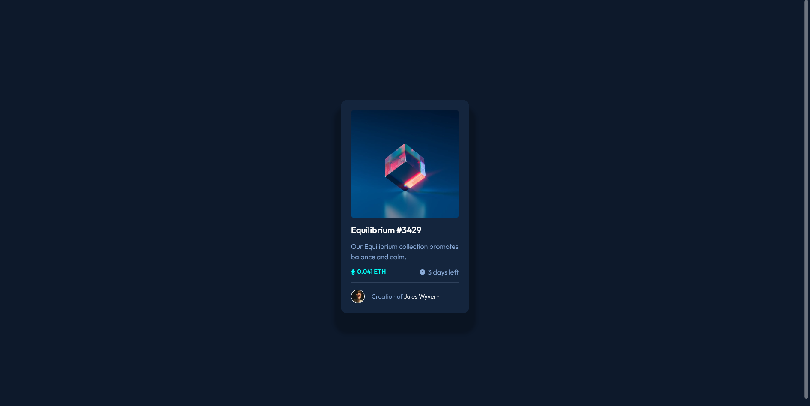

# Frontend Mentor - NFT preview card component solution

This is a solution to the [NFT preview card component challenge on Frontend Mentor](https://www.frontendmentor.io/challenges/nft-preview-card-component-SbdUL_w0U).

## Table of contents

- [Overview](#overview)
  - [The challenge](#the-challenge)
  - [Screenshot](#screenshot)
  - [Links](#links)
- [My process](#my-process)
  - [Built with](#built-with)
- [Author](#author)

## Overview

This was a simple challenge, but it's always good to re-exercise these simple things. It helps to create a sense of componentization and create a certain muscle memory for this type of activity.

### The challenge

Users should be able to:

- View the optimal layout depending on their device's screen size

### Screenshot

### Links

- Solution URL: [Add solution URL here](https://your-solution-url.com)
- Live Site URL: [Add live site URL here](https://your-live-site-url.com)

## My process

As it was a simple challenge and similar to others I've done, I tried to repeat the same steps to just memorize how to make this type of component.

### Built with

- CSS custom properties
- Flexbox
- Mobile-first workflow

## Author

- LinkedIn - [Caio Alves](https://www.linkedin.com/in/caioalvesp/)
- Frontend Mentor - [@caioalvesp](https://www.frontendmentor.io/profile/caioalvesp)
- GitHub - [@caioalvesp](https://github.com/caioalvesp)
